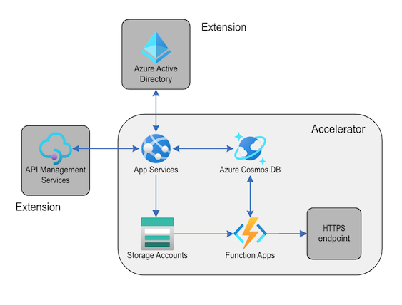
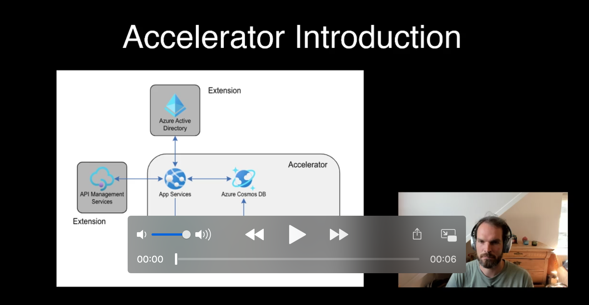

 

# Welcome to the WebAPI-CosmosDB-Storage-Functions accelerator

This accelerator pattern is a good fit for scenarios where you want to build a backend system to receive, process and store any type of data.

This accelerator provides you with the following components: HTTP based WebAPI, CosmosDB database, Storage Account and a function, which listens to changes in the CosmosDB database

## Available versions

| Programming language | Framework | Version |
| -------------------- | --------- | ------- |
| [C#]()               | dotnet    | 3.1     |
| [javascript]()       | node.js   | 12.18   |

## Recommended usage

This accelerator pattern is a good fit for scenarios where you want to build a backend system to receive, process and store any type of data.

A good example use-case is to retrieve audio files, which you want to anaylaze using an external service like Cognitive Services and store the audiofiles together with metadata for further analytic scenarios.

## Not recommended usage

This accelerator is not a good fit if you want to orchestrate longer running workflows, or need to analyze a larger set of media files in batch. For those use cases, we recommend you looking at [these accelerators](http://www.microsoft.com).

## Accelarator Documentaion

- [Overview](docs)
- Individual Components
    - [webapi](docs)
    - [CosmosDB](docs)
    - [Storage](docs)
    - [Function](docs)
- [Workflows and deployment](docs)
- [Observability and Monitoring](docs)

## Accelerator Introduction Video

